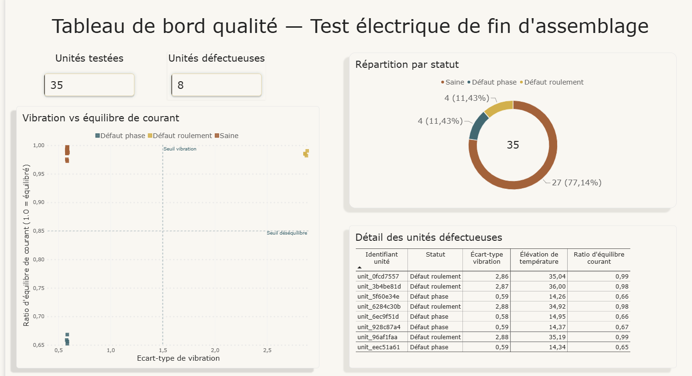
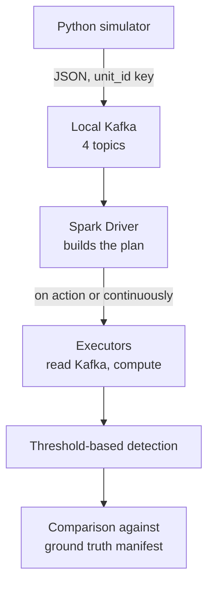
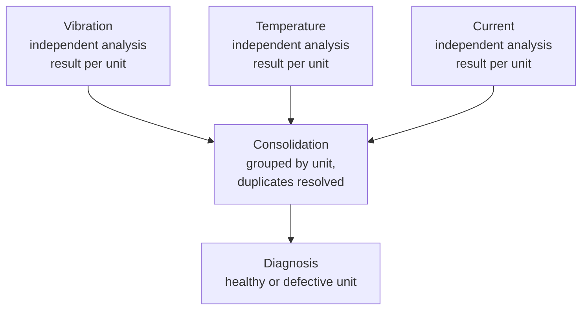
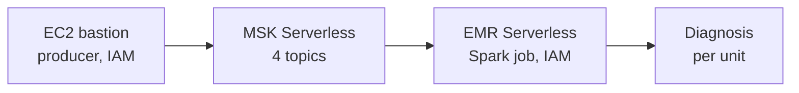
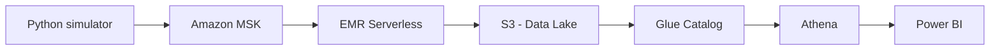

# EV Powertrain Manufacturing Analytics

[🇫🇷 Français](README.md) | 🇬🇧 English

## In short

Real-time data pipeline simulating a manufacturing line for permanent magnet synchronous motors (PMSM) used in electric vehicles — from IoT sensor ingestion (temperature, vibration, current, torque) to anomaly detection and business reporting.

Second portfolio project, complementary to the [Electric Mobility Platform](https://github.com/thcarole1/electric-mobility-platform) project, focused on skills not yet demonstrated: Kafka, Spark.

**Current state: both batch and streaming pipelines (1-sensor and 3-sensor) validated locally. Full target AWS architecture, validated end to end** — ingestion (MSK Serverless), detection (EMR Serverless), persistent storage (S3), querying (Athena), reporting (Power BI), and CI/CD (GitHub Actions). Ephemeral infrastructure (MSK, bastion, EMR) is torn down at the end of each session; the data and its querying layer (S3, Glue Catalog, Athena) survive in a separate Terraform module.

## Understanding this project in 2 minutes (no technical jargon)

This project simulates an electric motor manufacturing line for vehicles. Every motor built goes through a **30-second electrical test at the end of assembly**, during which several sensors record its behavior. The goal: automatically flag poorly assembled motors, with no human intervention, the moment they come off the line.

**What each sensor monitors:**

| Sensor | What it reveals |
|---|---|
| Vibration | A motor vibrating abnormally often points to a poorly mounted bearing |
| Electrical current | An imbalance between the three electrical phases often points to a loose connection |
| Temperature | Measured during the test, but not yet used in the final decision (the two targeted defects already show up clearly on the two measurements above) |
| Motor torque | Measured, but not yet used in the current detection logic |

**How the "good" or "defective" decision is made:** each measurement is compared against a threshold beyond which it's considered abnormal. If at least one measurement crosses its threshold, the motor is flagged as defective; otherwise, it's approved.

**Who makes this decision, and when:** not a human, and not while the test is running — it's **Apache Spark**, the data processing engine at the core of this project, that analyzes the measurements and delivers its verdict a few seconds after the test ends.

**Result achieved**: out of 50 simulated motors tested, all 14 genuinely defective units were detected, with zero healthy motors incorrectly flagged.

*Honest note: current thresholds were calibrated against the simulator's known parameters. Before a real production deployment, they would need to be recalibrated on real test data.*

## Key results

**Batch** — precision and recall of 1.00 on 50 tested units.


**Streaming, 3 sensors, validated at scale** — 14/14 defective units detected, 0 false positives out of 36 healthy units. Details in [ADR-004](docs/adr/0004-architecture-decouplee-streaming-3-capteurs.en.md).

**AWS, ingestion — MSK Serverless validated end to end** — default VPC reused, EC2 bastion with no SSH key (SSM access only), IAM scoped to the cluster. Full details, proof, and incidents in [ADR-005](docs/adr/0005-architecture-deploiement-aws.en.md).

**AWS, detection — EMR Serverless validated end to end** — standalone Spark job, native IAM authentication to MSK Serverless (after abandoning Glue, currently incompatible at the Terraform provider level). 55 real units read from MSK and classified: **12/12 defective units detected, 0 false positives**. Full details, proofs, and incidents in [ADR-006](docs/adr/0006-emr-serverless-abandon-glue.en.md) and [docs/proofs/](docs/proofs/).

**AWS, storage — persistent S3 data lake, separate from ephemeral infrastructure** — dedicated Terraform module (`terraform/data`), destroyed independently from `terraform/main`: detection results (Parquet) survive MSK/bastion/EMR being torn down between sessions. Validated after fixing a permission incident (missing `s3:DeleteObject` for overwriting results): 35/35 units classified, 8/8 defects detected, 0 false positives, results confirmed present after tearing down the ephemeral infra. Full details in [ADR-007](docs/adr/0007-data-lake-module-persistant.en.md).

**AWS, querying — Athena validated on persisted data** — Glue Data Catalog table with an explicit schema (no crawler, zero cost), dedicated Athena workgroup. Real queries from the console: aggregation confirming 35 units, 8 defective — an exact match with the EMR job's result. Negligible cost (a fraction of a cent for current usage). Details in [ADR-008](docs/adr/0008-athena-glue-catalog.en.md).

**AWS, reporting — Power BI, full chain validated visually** — native Athena connector, dashboard with KPI cards, breakdown by status, defective-unit detail table, and detection thresholds plotted on a scatter chart. Same figures as Athena and the EMR job (35 units, 8 defective). Details in [ADR-009](docs/adr/0009-powerbi-restitution.en.md).



## Validated pipeline (local)



## 3-sensor detection pipeline (decoupled architecture)



Each sensor is processed by its own streaming query (session window), independently of the other two. Results are then consolidated per unit — with residual duplicates resolved — before the final diagnosis. Full details in [ADR-004](docs/adr/0004-architecture-decouplee-streaming-3-capteurs.en.md).

**Why 3 sensors here, when the local pipeline uses 4 topics?** The 4 Kafka topics correspond to the 4 sensor types planned in the original brief — one topic per sensor, regardless of whether it's actually used downstream. Only 3 are used by detection: the two targeted defect scenarios don't require torque. The `sensor-torque` topic exists and receives simulated data, but isn't used in any classification logic yet.

## Validated AWS pipeline (MSK Serverless → EMR Serverless)



The bastion (SSM access only, no SSH key) simulates and sends units to MSK Serverless. EMR Serverless reads this data with the same IAM authentication mechanism, runs detection, and writes its result to the job's logs. Glue was explored first, then abandoned — incompatible with MSK Serverless's IAM authentication at the current Terraform provider level. Full details and incidents in [ADR-006](docs/adr/0006-emr-serverless-abandon-glue.en.md).

## Full architecture (AWS, validated)



The only diagram showing the full end-to-end chain — each piece is individually detailed, with its proof of functioning, in the sections and ADRs above.

## Tech stack

| Domain | Technology | Status |
|---|---|---|
| Data simulation | Python (numpy) | Done |
| Streaming ingestion (local) | Kafka (local, KRaft) | Done |
| Streaming ingestion (AWS) | Amazon MSK Serverless | Done, validated end to end |
| Batch processing | PySpark (`spark.read`) | Done |
| Streaming processing (1 sensor) | PySpark (`spark.readStream`, session window) | Done |
| Streaming processing (3 sensors) | Decoupled architecture (3 streams + batch join) | Done, validated at 50 units |
| Anomaly detection (AWS) | EMR Serverless (Spark job, IAM) | Done, validated at 55 units |
| Storage | S3, persistent Terraform module, Parquet results | Done |
| Querying | Athena + Glue Data Catalog (explicit-schema table) | Done |
| Reporting | Power BI (native Athena connector) | Done |
| Infrastructure (Terraform) | MSK Serverless, EMR Serverless, VPC, IAM, bastion (ephemeral) + S3, Glue Catalog, Athena (persistent, separate module) | Done |
| CI/CD | GitHub Actions (tests + Terraform validation) | Done |

## Project status

| Item | Count |
|---|---|
| Phases completed | Phase 0 scoping + full local validation + complete AWS target architecture + CI/CD |
| ADRs | 10 (all translated to English) |
| Tests | 30 |

## Running locally

```bash
python -m venv .venv
source .venv/bin/activate  # or .venv\Scripts\activate on Windows outside WSL
pip install -r requirements.txt
python -m pytest tests/ -v

# Local Kafka cluster (see local-dev/kafka/docker-compose.yml)
docker compose -f local-dev/kafka/docker-compose.yml up -d
```

**Batch:**
```bash
python stream_to_kafka.py --num-units 50
python detect_anomalies_batch.py
```

**Streaming, 1 sensor** (two terminals):
```bash
python detect_anomalies_streaming.py
```
```bash
python stream_to_kafka_realtime.py --num-units 10
```

**Streaming, 3 sensors** (two terminals, then a separate join):
```bash
python stream_sensors_to_files.py
```
```bash
python stream_to_kafka_realtime.py --num-units 50
```
Once units have finalized (`Ctrl+C` on the first terminal):
```bash
python detect_anomalies_from_streaming_files.py
```

Full details on the approaches and incidents encountered: [ADR-002](docs/adr/0002-simulation-capteurs-iot-test-electrique-final.en.md) (simulator, aliasing), [ADR-003](docs/adr/0003-detection-streaming-session-window-watermark.en.md) (1-sensor streaming), [ADR-004](docs/adr/0004-architecture-decouplee-streaming-3-capteurs.en.md) (3-sensor streaming), [ADR-005](docs/adr/0005-architecture-deploiement-aws.en.md) (MSK Serverless), [ADR-006](docs/adr/0006-emr-serverless-abandon-glue.en.md) (EMR Serverless).

## Architecture decisions

Originally written in French, this project's target job market — every ADR is now also available in English.

- [ADR-001 — Reusing the existing AWS account, isolation via tags](docs/adr/0001-utilisation-compte-aws-existant.en.md) ([🇫🇷](docs/adr/0001-utilisation-compte-aws-existant.md))
- [ADR-002 — IoT sensor simulation for the end-of-line electrical test](docs/adr/0002-simulation-capteurs-iot-test-electrique-final.en.md) ([🇫🇷](docs/adr/0002-simulation-capteurs-iot-test-electrique-final.md))
- [ADR-003 — Streaming detection (session window, watermark, resilience)](docs/adr/0003-detection-streaming-session-window-watermark.en.md) ([🇫🇷](docs/adr/0003-detection-streaming-session-window-watermark.md))
- [ADR-004 — Decoupled architecture for 3-sensor streaming detection](docs/adr/0004-architecture-decouplee-streaming-3-capteurs.en.md) ([🇫🇷](docs/adr/0004-architecture-decouplee-streaming-3-capteurs.md))
- [ADR-005 — AWS deployment architecture (backend, VPC, MSK Serverless, bastion)](docs/adr/0005-architecture-deploiement-aws.en.md) ([🇫🇷](docs/adr/0005-architecture-deploiement-aws.md))
- [ADR-006 — Detection via EMR Serverless (Glue abandoned)](docs/adr/0006-emr-serverless-abandon-glue.en.md) ([🇫🇷](docs/adr/0006-emr-serverless-abandon-glue.md))
- [ADR-007 — Separate Terraform module for the persistent data lake](docs/adr/0007-data-lake-module-persistant.en.md) ([🇫🇷](docs/adr/0007-data-lake-module-persistant.md))
- [ADR-008 — Athena querying on the persistent data lake](docs/adr/0008-athena-glue-catalog.en.md) ([🇫🇷](docs/adr/0008-athena-glue-catalog.md))
- [ADR-009 — Reporting via Power BI](docs/adr/0009-powerbi-restitution.en.md) ([🇫🇷](docs/adr/0009-powerbi-restitution.md))
- [ADR-010 — Continuous integration via GitHub Actions](docs/adr/0010-cicd-github-actions.en.md) ([🇫🇷](docs/adr/0010-cicd-github-actions.md))

## Next steps

- Oral pitch, final portfolio review (the technical roadmap is now complete)
