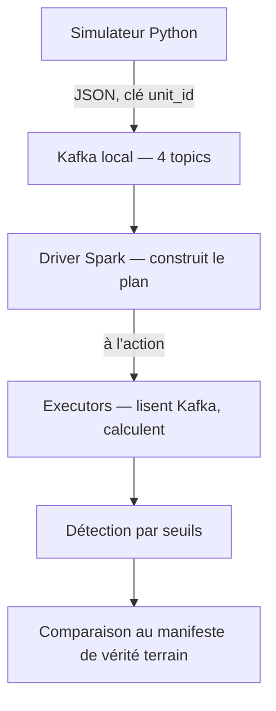
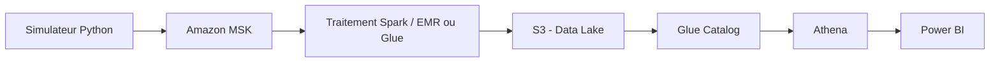

# EV Powertrain Manufacturing Analytics

## En bref

Pipeline de données temps réel simulant une ligne de production de moteurs électriques synchrones à aimants permanents (PMSM), de l'ingestion de capteurs IoT (température, vibration, courant, couple) jusqu'à la détection d'anomalies et la restitution métier.

Second projet de portfolio, complémentaire au projet [Electric Mobility Platform](LIEN_A_COMPLETER), axé sur des compétences non démontrées jusqu'ici : Kafka, Spark, et potentiellement Kubernetes/LLM en option.

**État actuel : pipeline complet validé en local (Kafka + Spark, sans AWS pour l'instant).** Le déploiement sur AWS MSK/Glue est la prochaine étape, pas encore réalisée — voir [ADR-002](docs/adr/0002-simulation-capteurs-iot-test-electrique-final.md) et la roadmap.

## Résultat clé

Détection de deux défauts d'assemblage (roulement mal monté, déséquilibre de phase électrique) sur des unités simulées passant un test électrique de fin de ligne — **précision et rappel de 1.00 sur 50 unités testées**, évalués contre un jeu de vérité terrain jamais exposé à la logique de détection.


Les deux défauts produisent des signatures géométriquement séparées : le déséquilibre de phase n'affecte que l'axe courant, le défaut de roulement n'affecte que l'axe vibration — visible directement sur le graphique.

## Pipeline validé (local)



## Architecture cible (AWS, à déployer)



## Stack technique

| Domaine | Technologie | Statut |
|---|---|---|
| Simulation de données | Python (numpy) | Fait |
| Ingestion streaming | Kafka (local, KRaft) → Amazon MSK | Local fait, AWS à faire |
| Traitement | PySpark (batch, local) → Spark Streaming / Glue ou EMR | Batch local fait, streaming et AWS à faire |
| Détection d'anomalie | Seuils calibrés, PySpark | Fait (batch) |
| Stockage | — | À faire |
| Requêtage | — | À faire |
| Restitution | — | À faire |
| Infrastructure | — | À faire |
| CI/CD | — | À faire |

## État du projet

| Élément | Nombre |
|---|---|
| Phases terminées | Cadrage Phase 0 + validation locale Kafka/Spark |
| ADR | 2 |
| Tests | 19 |

## Simulateur et détection (local)

```bash
python -m venv .venv
source .venv/bin/activate  # ou .venv\Scripts\activate sous Windows hors WSL
pip install -r requirements.txt
python -m pytest tests/ -v

# Cluster Kafka local (voir local-dev/kafka/docker-compose.yml)
docker compose -f local-dev/kafka/docker-compose.yml up -d

python stream_to_kafka.py --num-units 50
python detect_anomalies_batch.py
```

Détail complet de l'approche et des deux incidents rencontrés (identifiants non uniques, repliement de spectre sur les signaux) dans [ADR-002](docs/adr/0002-simulation-capteurs-iot-test-electrique-final.md).

## Décisions d'architecture

- [ADR-001 — Utilisation du compte AWS existant, séparation par tags](docs/adr/0001-utilisation-compte-aws-existant.md)
- [ADR-002 — Simulation des capteurs IoT pour le test électrique final](docs/adr/0002-simulation-capteurs-iot-test-electrique-final.md)

## Prochaines étapes

- Passage de `spark.read` (batch) à `spark.readStream` avec watermark et horloge temporelle réelle (le champ `t` actuel, relatif à chaque unité, ne peut pas servir de colonne de watermark)
- Décision à trancher : déploiement AWS (MSK Serverless envisagé) vs poursuite en local — voir le journal de décisions
