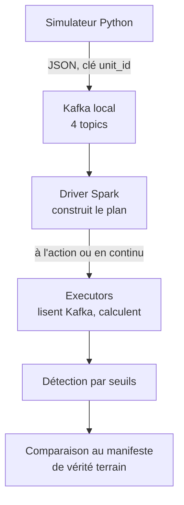
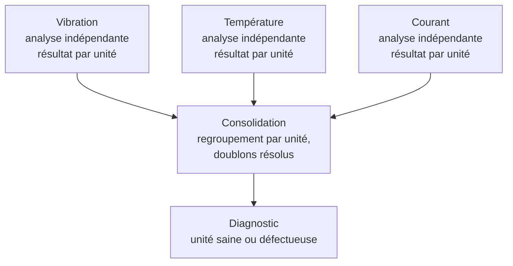
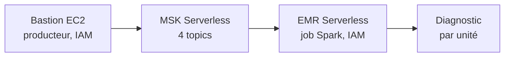
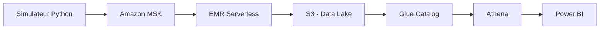

# EV Powertrain Manufacturing Analytics

🇫🇷 Français | [🇬🇧 English](README.en.md)

## En bref

Pipeline de données temps réel simulant une ligne de production de moteurs électriques synchrones à aimants permanents (PMSM), de l'ingestion de capteurs IoT (température, vibration, courant, couple) jusqu'à la détection d'anomalies et la restitution métier.

Second projet de portfolio, complémentaire au projet [Electric Mobility Platform](LIEN_A_COMPLETER), axé sur des compétences non démontrées jusqu'ici : Kafka, Spark, et potentiellement Kubernetes/LLM en option.

**État actuel : pipeline batch et streaming (1 capteur et 3 capteurs) validés en local. Déploiement AWS réel validé bout en bout — ingestion (MSK Serverless), détection (EMR Serverless) et stockage persistant (S3, résultats Parquet).** L'infrastructure éphémère (MSK, bastion, EMR) est détruite en fin de session ; le bucket S3 des résultats, lui, survit dans un module Terraform séparé. Athena, Power BI, CI/CD restent à faire.

## Comprendre ce projet en 2 minutes (sans jargon technique)

Ce projet simule une chaîne de fabrication de moteurs électriques pour véhicules. Chaque moteur fabriqué passe un **test électrique de 30 secondes en fin d'assemblage**, pendant lequel plusieurs capteurs enregistrent son comportement. Le but : repérer automatiquement les moteurs mal assemblés, sans intervention humaine, au moment même où ils sortent de la chaîne.

**Ce que chaque capteur surveille :**

| Capteur | Ce qu'il révèle |
|---|---|
| Vibration | Un moteur qui vibre anormalement trahit souvent un roulement mal monté à l'assemblage |
| Courant électrique | Un déséquilibre entre les trois phases électriques trahit souvent une connexion mal serrée |
| Température | Mesurée pendant le test, mais pas encore utilisée dans la décision finale (les deux défauts recherchés se voient déjà sur les deux mesures ci-dessus) |
| Couple moteur | Mesuré, mais pas encore exploité dans la détection actuelle |

**Comment la décision "bon" ou "défectueux" est prise :** chaque mesure est comparée à un seuil au-delà duquel elle est jugée anormale. Si au moins une mesure dépasse son seuil, le moteur est marqué défectueux ; sinon, il est validé.

**Qui prend cette décision, et quand :** pas un humain, et pas pendant que le test se déroule — c'est **Apache Spark**, le moteur de traitement de données au cœur de ce projet, qui analyse les mesures et rend son verdict quelques secondes après la fin du test.

**Résultat obtenu** : sur 50 moteurs simulés testés, les 14 réellement défectueux ont tous été détectés, sans qu'aucun moteur sain ne soit signalé à tort.

*Note honnête : les seuils actuels ont été calibrés sur les paramètres connus du simulateur. Avant un déploiement réel en production, ils devraient être recalibrés sur des données de test réelles.*

## Résultats clés

**Batch** — précision et rappel de 1.00 sur 50 unités testées.


**Streaming, 3 capteurs, validé à grande échelle** — 14/14 unités défectueuses détectées, 0 faux positif sur 36 unités saines. Détail dans [ADR-004](docs/adr/0004-architecture-decouplee-streaming-3-capteurs.md).

**AWS, ingestion — MSK Serverless validé bout en bout** — VPC par défaut réutilisé, bastion EC2 sans clé SSH (accès SSM uniquement), IAM scopé au cluster. Détail complet, preuve et incidents dans [ADR-005](docs/adr/0005-architecture-deploiement-aws.md).

**AWS, détection — EMR Serverless validé bout en bout** — job Spark autonome, authentification IAM native vers MSK Serverless (après abandon de Glue, incompatible avec Terraform à ce jour). 55 unités réelles lues depuis MSK et classifiées : **12/12 défectueuses détectées, 0 faux positif**. Détail complet, preuves et incidents dans [ADR-006](docs/adr/0006-emr-serverless-abandon-glue.md) et [docs/proofs/](docs/proofs/).

**AWS, stockage — data lake S3 persistant, séparé de l'infra éphémère** — module Terraform dédié (`terraform/data`), détruit indépendamment de `terraform/main` : les résultats de détection (Parquet) survivent à la destruction de MSK/bastion/EMR entre les sessions. Validé après correction d'un incident de permission (`s3:DeleteObject` manquant pour l'écrasement des résultats) : 35/35 unités classifiées, 8/8 défectueuses détectées, 0 faux positif, résultats confirmés présents après destruction de l'infra éphémère. Détail complet dans [ADR-007](docs/adr/0007-data-lake-module-persistant.md).

**AWS, requêtage — Athena validé sur les données persistées** — table Glue Data Catalog à schéma explicite (pas de Crawler, coût nul), groupe de travail Athena dédié. Requêtes réelles depuis la console : agrégation confirmant 35 unités, 8 défectueuses — correspondance exacte avec le résultat du job EMR. Coût négligeable (millième de centime pour l'usage actuel). Détail dans [ADR-008](docs/adr/0008-athena-glue-catalog.md).

## Pipeline validé (local)



## Pipeline de détection à 3 capteurs (architecture découplée)



Chaque capteur est traité par sa propre requête streaming (session window), indépendamment des deux autres. Les résultats sont ensuite consolidés par unité — avec résolution des doublons résiduels — avant le diagnostic final. Détail complet dans [ADR-004](docs/adr/0004-architecture-decouplee-streaming-3-capteurs.md).

**Pourquoi 3 capteurs ici, alors que le pipeline local utilise 4 topics ?** Les 4 topics Kafka correspondent aux 4 types de capteurs prévus dans le brief initial — un topic par capteur, indépendamment de son usage réel en aval. Seuls 3 sont exploités par la détection : les deux scénarios de panne retenus ne nécessitent pas le couple. Le topic `sensor-torque` existe, reçoit des données simulées, mais n'entre dans aucune logique de classification pour l'instant.

## Pipeline AWS validé (MSK Serverless → EMR Serverless)



Le bastion (accès SSM uniquement, aucune clé SSH) simule et envoie les unités vers MSK Serverless. EMR Serverless lit ces données avec le même mécanisme d'authentification IAM, exécute la détection, puis écrit son résultat dans les journaux du job. Glue a été exploré en premier puis abandonné — incompatible avec l'authentification IAM de MSK Serverless au niveau du fournisseur Terraform actuel. Détail complet et incidents dans [ADR-006](docs/adr/0006-emr-serverless-abandon-glue.md).

## Architecture cible (AWS, à déployer)



## Stack technique

| Domaine | Technologie | Statut |
|---|---|---|
| Simulation de données | Python (numpy) | Fait |
| Ingestion streaming (local) | Kafka (local, KRaft) | Fait |
| Ingestion streaming (AWS) | Amazon MSK Serverless | Fait, validé bout en bout |
| Traitement batch | PySpark (`spark.read`) | Fait |
| Traitement streaming (1 capteur) | PySpark (`spark.readStream`, session window) | Fait |
| Traitement streaming (3 capteurs) | Architecture découplée (3 flux + jointure batch) | Fait, validé à 50 unités |
| Détection d'anomalie (AWS) | EMR Serverless (job Spark, IAM) | Fait, validé à 55 unités |
| Stockage | S3, module Terraform persistant, résultats Parquet | Fait |
| Requêtage | Athena + Glue Data Catalog (table à schéma explicite) | Fait |
| Restitution | — | À faire |
| Infrastructure (Terraform) | MSK Serverless, EMR Serverless, VPC, IAM, bastion (éphémère) + S3, Glue Catalog, Athena (persistant, module séparé) | Fait |
| CI/CD | — | À faire |

## État du projet

| Élément | Nombre |
|---|---|
| Phases terminées | Cadrage Phase 0 + validation locale complète + déploiement AWS (ingestion + détection + stockage + requêtage) |
| ADR | 8 |
| Tests | 30 |

## Utilisation locale

```bash
python -m venv .venv
source .venv/bin/activate  # ou .venv\Scripts\activate sous Windows hors WSL
pip install -r requirements.txt
python -m pytest tests/ -v

# Cluster Kafka local (voir local-dev/kafka/docker-compose.yml)
docker compose -f local-dev/kafka/docker-compose.yml up -d
```

**Batch :**
```bash
python stream_to_kafka.py --num-units 50
python detect_anomalies_batch.py
```

**Streaming, 1 capteur** (deux terminaux) :
```bash
python detect_anomalies_streaming.py
```
```bash
python stream_to_kafka_realtime.py --num-units 10
```

**Streaming, 3 capteurs** (deux terminaux, puis jointure séparée) :
```bash
python stream_sensors_to_files.py
```
```bash
python stream_to_kafka_realtime.py --num-units 50
```
Une fois les unités finalisées (`Ctrl+C` sur le premier terminal) :
```bash
python detect_anomalies_from_streaming_files.py
```

Détail complet des approches et incidents rencontrés dans [ADR-002](docs/adr/0002-simulation-capteurs-iot-test-electrique-final.md) (simulateur, aliasing), [ADR-003](docs/adr/0003-detection-streaming-session-window-watermark.md) (streaming 1 capteur), [ADR-004](docs/adr/0004-architecture-decouplee-streaming-3-capteurs.md) (streaming 3 capteurs), [ADR-005](docs/adr/0005-architecture-deploiement-aws.md) (MSK Serverless), [ADR-006](docs/adr/0006-emr-serverless-abandon-glue.md) (EMR Serverless).

## Décisions d'architecture

- [ADR-001 — Utilisation du compte AWS existant, séparation par tags](docs/adr/0001-utilisation-compte-aws-existant.md)
- [ADR-002 — Simulation des capteurs IoT pour le test électrique final](docs/adr/0002-simulation-capteurs-iot-test-electrique-final.md)
- [ADR-003 — Détection en streaming (session window, watermark, résilience)](docs/adr/0003-detection-streaming-session-window-watermark.md)
- [ADR-004 — Architecture découplée pour la détection streaming à 3 capteurs](docs/adr/0004-architecture-decouplee-streaming-3-capteurs.md)
- [ADR-005 — Architecture de déploiement AWS (backend, VPC, MSK Serverless, bastion)](docs/adr/0005-architecture-deploiement-aws.md)
- [ADR-006 — Détection via EMR Serverless (abandon de Glue)](docs/adr/0006-emr-serverless-abandon-glue.md)
- [ADR-007 — Module Terraform séparé pour le data lake persistant](docs/adr/0007-data-lake-module-persistant.md)
- [ADR-008 — Requêtage Athena sur le data lake persistant](docs/adr/0008-athena-glue-catalog.md)

## Prochaines étapes

- Power BI (connexion à Athena)
- CI/CD
