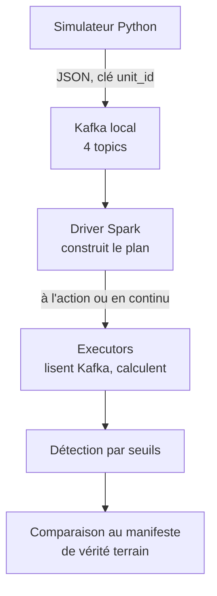
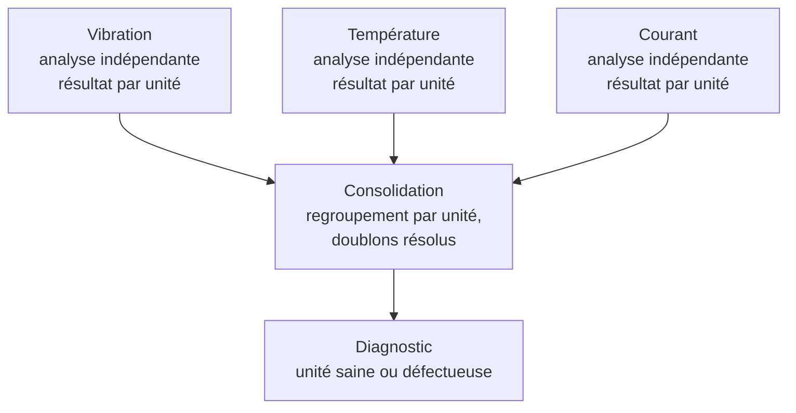
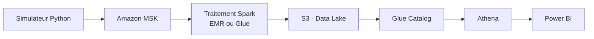

# EV Powertrain Manufacturing Analytics

## En bref

Pipeline de données temps réel simulant une ligne de production de moteurs électriques synchrones à aimants permanents (PMSM), de l'ingestion de capteurs IoT (température, vibration, courant, couple) jusqu'à la détection d'anomalies et la restitution métier.

Second projet de portfolio, complémentaire au projet [Electric Mobility Platform](LIEN_A_COMPLETER), axé sur des compétences non démontrées jusqu'ici : Kafka, Spark, et potentiellement Kubernetes/LLM en option.

**État actuel : pipeline batch et streaming (1 capteur et 3 capteurs) validés en local. Premier déploiement AWS réel effectué et validé (MSK Serverless), puis détruit en fin de session pour maîtriser les coûts.** Glue/EMR, S3, Athena, Power BI restent à faire.

## Résultats clés

**Batch** — précision et rappel de 1.00 sur 50 unités testées.


**Streaming, 3 capteurs, validé à grande échelle** — 14/14 unités défectueuses détectées, 0 faux positif sur 36 unités saines. Détail dans [ADR-004](docs/adr/0004-architecture-decouplee-streaming-3-capteurs.md).

**AWS, MSK Serverless — premier déploiement réel validé bout en bout** — VPC par défaut réutilisé, bastion EC2 sans clé SSH (accès SSM uniquement), IAM scopé au cluster. Le vrai simulateur du projet (pas un message de test) a produit 5 unités vers un cluster MSK Serverless réel ; relecture confirmée structurellement correcte (15 000 messages sur un topic, correspondance exacte au calcul attendu). Cinq incidents réels diagnostiqués et documentés. Détail complet, preuve et incidents dans [ADR-005](docs/adr/0005-architecture-deploiement-aws.md).

## Pipeline validé (local)



## Pipeline de détection à 3 capteurs (architecture découplée)



Chaque capteur est traité par sa propre requête streaming (session window), indépendamment des deux autres. Les résultats sont ensuite consolidés par unité — avec résolution des doublons résiduels — avant le diagnostic final. Détail complet (pourquoi une jointure stream-stream native a été abandonnée au profit de cette architecture) dans [ADR-004](docs/adr/0004-architecture-decouplee-streaming-3-capteurs.md).

## Architecture cible (AWS, à déployer)



## Stack technique

| Domaine | Technologie | Statut |
|---|---|---|
| Simulation de données | Python (numpy) | Fait |
| Ingestion streaming (local) | Kafka (local, KRaft) | Fait |
| Ingestion streaming (AWS) | Amazon MSK Serverless | Déployé et validé, détruit après session |
| Traitement batch | PySpark (`spark.read`) | Fait |
| Traitement streaming (1 capteur) | PySpark (`spark.readStream`, session window) | Fait |
| Traitement streaming (3 capteurs) | Architecture découplée (3 flux + jointure batch) | Fait, validé à 50 unités |
| Détection d'anomalie (AWS, Glue/EMR) | — | À faire |
| Stockage | — | À faire |
| Requêtage | — | À faire |
| Restitution | — | À faire |
| Infrastructure (Terraform) | MSK Serverless, VPC, IAM, bastion | Fait pour MSK ; Glue/S3 à ajouter |
| CI/CD | — | À faire |

## État du projet

| Élément | Nombre |
|---|---|
| Phases terminées | Cadrage Phase 0 + validation locale complète + premier déploiement AWS (MSK) |
| ADR | 5 |
| Tests | 30 |

## Utilisation locale

```bash
python -m venv .venv
source .venv/bin/activate  # ou .venv\Scripts\activate sous Windows hors WSL
pip install -r requirements.txt
python -m pytest tests/ -v

# Cluster Kafka local (voir local-dev/kafka/docker-compose.yml)
docker compose -f local-dev/kafka/docker-compose.yml up -d
```

**Batch :**
```bash
python stream_to_kafka.py --num-units 50
python detect_anomalies_batch.py
```

**Streaming, 1 capteur** (deux terminaux) :
```bash
python detect_anomalies_streaming.py
```
```bash
python stream_to_kafka_realtime.py --num-units 10
```

**Streaming, 3 capteurs** (deux terminaux, puis jointure séparée) :
```bash
python stream_sensors_to_files.py
```
```bash
python stream_to_kafka_realtime.py --num-units 50
```
Une fois les unités finalisées (`Ctrl+C` sur le premier terminal) :
```bash
python detect_anomalies_from_streaming_files.py
```

Détail complet des approches et incidents rencontrés dans [ADR-002](docs/adr/0002-simulation-capteurs-iot-test-electrique-final.md) (simulateur, aliasing), [ADR-003](docs/adr/0003-detection-streaming-session-window-watermark.md) (streaming 1 capteur), [ADR-004](docs/adr/0004-architecture-decouplee-streaming-3-capteurs.md) (streaming 3 capteurs).

## Décisions d'architecture

- [ADR-001 — Utilisation du compte AWS existant, séparation par tags](docs/adr/0001-utilisation-compte-aws-existant.md)
- [ADR-002 — Simulation des capteurs IoT pour le test électrique final](docs/adr/0002-simulation-capteurs-iot-test-electrique-final.md)
- [ADR-003 — Détection en streaming (session window, watermark, résilience)](docs/adr/0003-detection-streaming-session-window-watermark.md)
- [ADR-004 — Architecture découplée pour la détection streaming à 3 capteurs](docs/adr/0004-architecture-decouplee-streaming-3-capteurs.md)
- [ADR-005 — Architecture de déploiement AWS (backend, VPC, MSK Serverless, bastion)](docs/adr/0005-architecture-deploiement-aws.md)

## Prochaines étapes

- Détection Spark/Glue sur MSK Serverless (nouvelle session)
- Redéploiement de l'infrastructure via `terraform apply` (state déjà en place)
