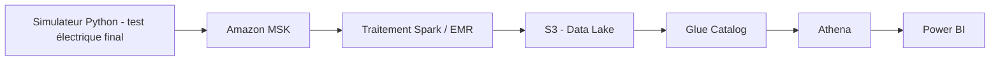

# EV Powertrain Manufacturing Analytics

## En bref

Pipeline de données temps réel simulant une ligne de production de moteurs électriques synchrones à aimants permanents (PMSM), de l'ingestion de capteurs IoT (température, vibration, courant, couple) jusqu'à la détection d'anomalies et la restitution métier.

Second projet de portfolio, complémentaire au projet [Electric Mobility Platform](LIEN_A_COMPLETER), axé sur des compétences non démontrées jusqu'ici : Kafka, Spark, et potentiellement Kubernetes/LLM en option.

## Architecture



*Schéma à affiner au fil des phases — voir `docs/adr/` pour le détail des décisions.*

## Stack technique

| Domaine | Technologie |
|---|---|
| Simulation de données | Python (numpy) |
| Ingestion streaming | Amazon MSK (Kafka managé) |
| Traitement | Spark (Glue puis EMR) |
| Stockage | S3 |
| Requêtage | Athena |
| Restitution | Power BI |
| Infrastructure | Terraform |
| CI/CD | GitHub Actions |

## État du projet

| Élément | Nombre |
|---|---|
| Phases terminées | 1 / 7 (Phase 0 — cadrage) |
| ADR | 2 |
| Tests | 6 |

## Simulateur de données (Phase 1)

Génère des unités PMSM testées en fin de ligne d'assemblage — test électrique final de 30 secondes, avec une proportion configurable d'unités présentant un défaut d'assemblage (dégradation de roulement, déséquilibre de phase). Détail complet dans [ADR-002](docs/adr/0002-simulation-capteurs-iot-test-electrique-final.md).

```bash
pip install -r requirements.txt
python -m pytest tests/ -v
python -m simulator.generator --num-units 100 --output-dir data/output --seed 42
```

## Décisions d'architecture

Les décisions techniques significatives sont documentées dans [`docs/adr/`](docs/adr/), au format Contexte / Décision / Pourquoi / Conséquences.

- [ADR-001 — Utilisation du compte AWS existant, séparation par tags](docs/adr/0001-utilisation-compte-aws-existant.md)
- [ADR-002 — Simulation des capteurs IoT pour le test électrique final](docs/adr/0002-simulation-capteurs-iot-test-electrique-final.md)

## Démarrage

*Section à compléter une fois l'infrastructure Kafka/Spark en place.*
