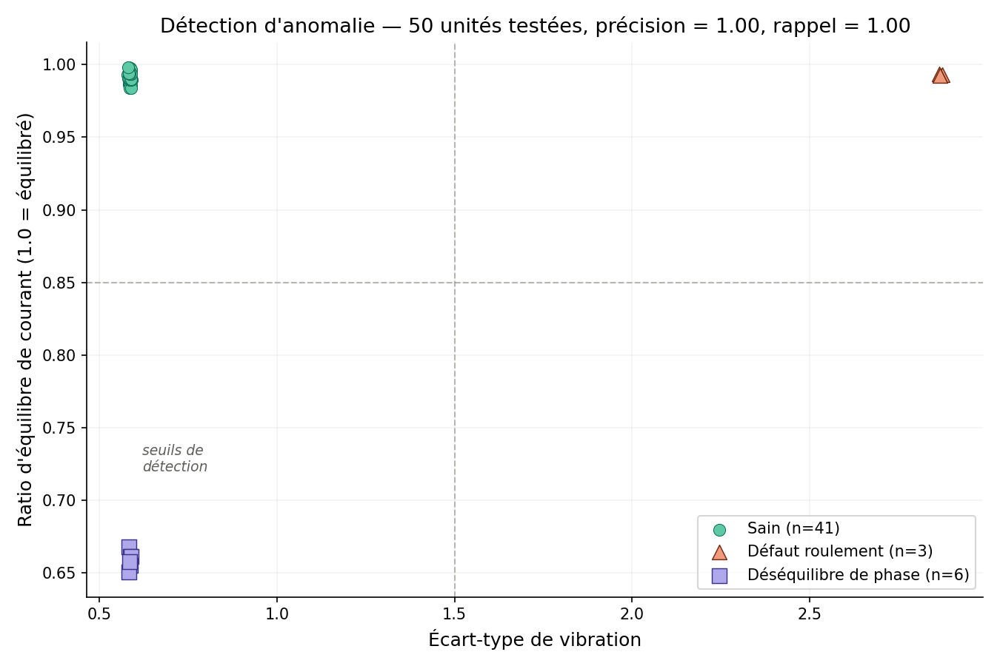
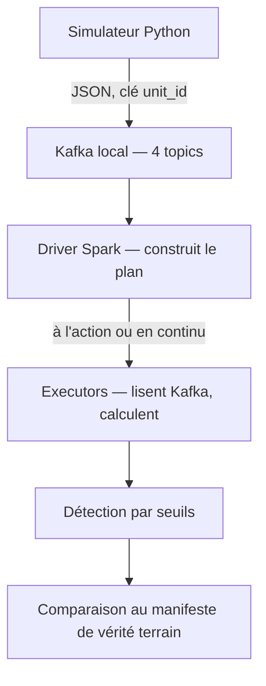
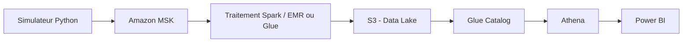

# EV Powertrain Manufacturing Analytics

## En bref

Pipeline de données temps réel simulant une ligne de production de moteurs électriques synchrones à aimants permanents (PMSM), de l'ingestion de capteurs IoT (température, vibration, courant, couple) jusqu'à la détection d'anomalies et la restitution métier.

Second projet de portfolio, complémentaire au projet [Electric Mobility Platform](LIEN_A_COMPLETER), axé sur des compétences non démontrées jusqu'ici : Kafka, Spark, et potentiellement Kubernetes/LLM en option.

**État actuel : pipeline batch et streaming tous deux validés en local (Kafka + Spark, sans AWS pour l'instant).** Le déploiement sur AWS MSK/Glue est la prochaine étape, pas encore réalisée.

## Résultats clés

**Batch** — détection de deux défauts d'assemblage (roulement mal monté, déséquilibre de phase électrique) sur des unités simulées passant un test électrique de fin de ligne — **précision et rappel de 1.00 sur 50 unités testées**, évalués contre un jeu de vérité terrain jamais exposé à la logique de détection.



**Streaming** — même détection (défaut de roulement, via la vibration) exécutée en continu sur `spark.readStream`, avec finalisation automatique par `session_window` dès qu'une unité termine son test — validé sur 10 unités simulées en parallèle, à rythme réaliste (une nouvelle unité toutes les 5-10 secondes). Détail complet des décisions et incidents dans [ADR-003](docs/adr/0003-detection-streaming-session-window-watermark.md).

## Pipeline validé (local)



## Architecture cible (AWS, à déployer)



## Stack technique

| Domaine | Technologie | Statut |
|---|---|---|
| Simulation de données | Python (numpy) | Fait |
| Ingestion streaming | Kafka (local, KRaft) → Amazon MSK | Local fait, AWS à faire |
| Traitement batch | PySpark (`spark.read`) | Fait |
| Traitement streaming | PySpark (`spark.readStream`, session window) | Fait pour la vibration, courant/température à faire |
| Détection d'anomalie | Seuils calibrés, PySpark | Fait (batch et streaming partiel) |
| Stockage | — | À faire |
| Requêtage | — | À faire |
| Restitution | — | À faire |
| Infrastructure | — | À faire |
| CI/CD | — | À faire |

## État du projet

| Élément | Nombre |
|---|---|
| Phases terminées | Cadrage Phase 0 + validation locale Kafka/Spark (batch et streaming) |
| ADR | 3 |
| Tests | 21 |

## Utilisation locale

```bash
python -m venv .venv
source .venv/bin/activate  # ou .venv\Scripts\activate sous Windows hors WSL
pip install -r requirements.txt
python -m pytest tests/ -v

# Cluster Kafka local (voir local-dev/kafka/docker-compose.yml)
docker compose -f local-dev/kafka/docker-compose.yml up -d
```

**Batch :**
```bash
python stream_to_kafka.py --num-units 50
python detect_anomalies_batch.py
```

**Streaming** (deux terminaux) :
```bash
python detect_anomalies_streaming.py
```
```bash
python stream_to_kafka_realtime.py --num-units 10
```

Détail complet des deux approches et des incidents rencontrés dans [ADR-002](docs/adr/0002-simulation-capteurs-iot-test-electrique-final.md) (simulateur, aliasing) et [ADR-003](docs/adr/0003-detection-streaming-session-window-watermark.md) (streaming, session window, watermark).

## Décisions d'architecture

- [ADR-001 — Utilisation du compte AWS existant, séparation par tags](docs/adr/0001-utilisation-compte-aws-existant.md)
- [ADR-002 — Simulation des capteurs IoT pour le test électrique final](docs/adr/0002-simulation-capteurs-iot-test-electrique-final.md)
- [ADR-003 — Détection en streaming (session window, watermark, résilience)](docs/adr/0003-detection-streaming-session-window-watermark.md)

## Prochaines étapes

- Étendre la détection streaming aux trois capteurs (jointure stream-stream vibration/température/courant, avec ses propres contraintes de watermark)
- Décision à trancher : déploiement AWS (MSK Serverless envisagé) vs poursuite en local
