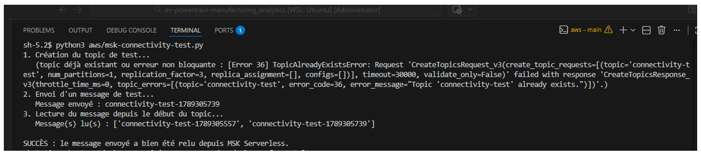
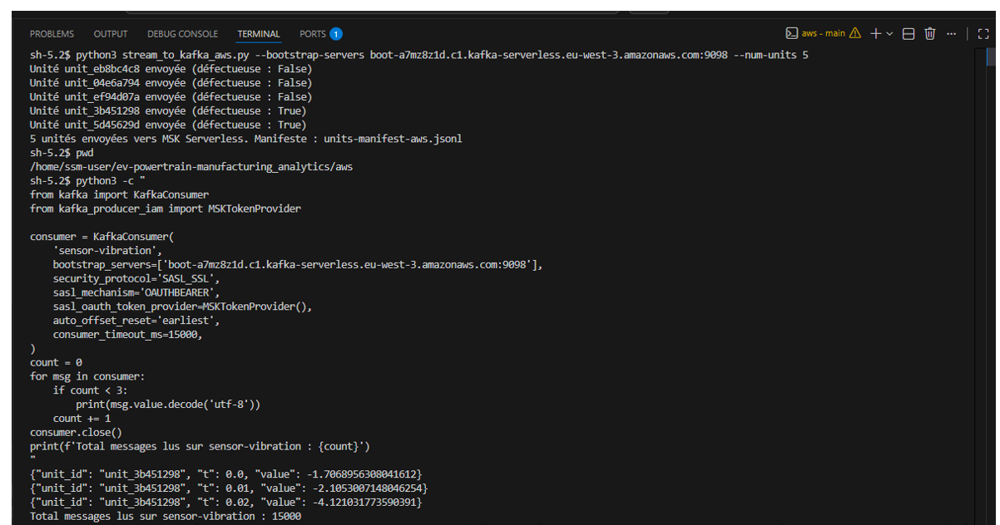

# ADR-005 — AWS deployment architecture (backend, VPC, MSK Serverless, bastion)

## Context

The pipeline (simulator, Kafka, Spark detection) is validated locally. This ADR documents the move to a real AWS deployment: Kafka via Amazon MSK, a prerequisite for the following phases (Glue/EMR, S3, Athena, Power BI).

## Decision

- **Terraform backend**: remote state on S3 (bucket `ev-powertrain-analytics-tfstate-fb5f6db7`), locking via DynamoDB (`ev-powertrain-analytics-tfstate-lock`), both created by a separate bootstrap module, in local state (chicken-and-egg problem).
- **VPC**: reuse of the account's default VPC, via Terraform data sources (`data "aws_vpc"`, `data "aws_subnets"`) — no dedicated VPC created for this project.
- **MSK Serverless** (not Provisioned) — a decision sketched earlier in the project, formalized here.
- **Cluster access**: MSK Serverless exposes no public access, only reachable from inside the VPC. A minimal EC2 instance, in a public subnet of the default VPC, serves as a bastion to run the Kafka producer (`stream_to_kafka_realtime.py`). Access managed exclusively via AWS Systems Manager Session Manager — no SSH key, no inbound rule on the bastion's security group.
- **No NAT gateway**: the bastion sits directly in a public subnet (public IP, outbound via the internet gateway already present on the default VPC) — SSM only needs outbound access. MSK Serverless stays in subnets with no internet route, not needing one.
- **Glue** (Spark processing, next phase) will read MSK directly, natively within the VPC, without going through the bastion.

## Why

**Default VPC rather than a dedicated one**: creating and managing a VPC (subnets, route tables, internet gateway) has already been demonstrated on a prior project (Electric Mobility Platform, via MWAA) — redoing it here would add nothing new to demonstrate, for a real development-time cost. Effort is concentrated on MSK and Glue, this project's differentiating skills.

**No NAT gateway**: a NAT gateway costs about $32/month if left running continuously, for an occasional, minimal outbound need (the bastion, only during work sessions). A public subnet with a public IP avoids this cost, with no significant security trade-off since no inbound rule is ever opened — only traffic initiated from the instance itself (toward SSM) is involved.

**SSM rather than SSH**: eliminates key-pair management and any exposure of port 22, consistent with the least-privilege principle already applied on this project (ADR-001).

## Consequences

- The default VPC is shared with any other workload present on this AWS account — consistent with the earlier choice not to isolate this project in a dedicated account (ADR-001), but means security groups must be explicitly scoped to this project to avoid any interference.
- The EC2 bastion is a continuously billed resource if not stopped or destroyed between sessions — to include in the end-of-session checklist, alongside MSK.
- Any future migration to a dedicated VPC (should isolation become necessary) would require revisiting this ADR and recreating network-dependent resources.

## Incidents

### Subnets within the same availability zone

`data.aws_subnets` returned every subnet in the default VPC, some of which share the same AZ — MSK Serverless explicitly rejects this case (`BadRequestException`). Fixed by precisely selecting one subnet per AZ via `data.aws_subnet` with `default_for_az = true`, iterated over `data.aws_availability_zones`.

### Restricted character set on security group descriptions

Descriptions written in proper French (accents, em dash) were rejected by AWS validation (`^[0-9A-Za-z_ .:/()#,@\[\]+=&;{}!$*-]*$`) — specific to `aws_security_group`'s `description` fields, not other resources. Fixed by rewriting these descriptions without accented characters.

### `kafka-python` version incompatibility with IAM authentication

The default `kafka-python` install (`3.0.11`, via `pip install kafka-python`) has an internal architecture different from what `aws-msk-iam-sasl-signer-python` expects, causing a `ModuleNotFoundError` and then a `KafkaTimeoutError` during SASL negotiation. Diagnosis confirmed by an external search: `kafka-python` introduced a breaking change in version 2.1.0 to its SASL handling, documented by the IAM signing library itself as breaking their OAUTHBEARER approach. Fixed by pinning `kafka-python==2.0.2` in `aws/requirements.txt`, distinct from the main `requirements.txt` (local Kafka, no IAM auth, unaffected by this constraint).

### Missing IAM permission for reading (`ReadData`)

The bastion's IAM policy granted `CreateTopic`, `DescribeTopic`, `WriteData`, but not `ReadData` — a design oversight, not an AWS error. Topic creation and message sending worked; reading failed with `TopicAuthorizationFailedError`. Fixed by explicitly adding `kafka-cluster:ReadData` on the topic resource.

### `replication_factor=-1` rejected by the client, while MSK Serverless requires it

MSK Serverless manages replication itself and does not accept an explicit client-side value — but `kafka-python==2.0.2` rejects `-1` (the "let the server decide" convention in other Kafka ecosystems) with a local validation error, before even reaching the server. Worked around by sending `replication_factor=3`: any positive value satisfies the client's validation, with no real effect server-side.

## Proof of functioning

End to end, on the real cluster: creation of 4 topics, streaming of 5 complete simulated units (the project's actual simulator, not a test message), read-back confirming a total of 15,000 messages on `sensor-vibration` (5 units × 100 Hz × 30s — an exact match), correct JSON structure, bearing-defect signature visible on the unit flagged defective in the manifest.

**Connectivity test** (produce, read back, confirm):

**Project's real pipeline, 5 units, volume verification**:

Infrastructure destroyed at the end of the session (`terraform destroy`) to avoid ongoing costs — to be redeployed via `terraform apply` when needed, with nothing lost: the remote state (S3) and the code remain intact.
